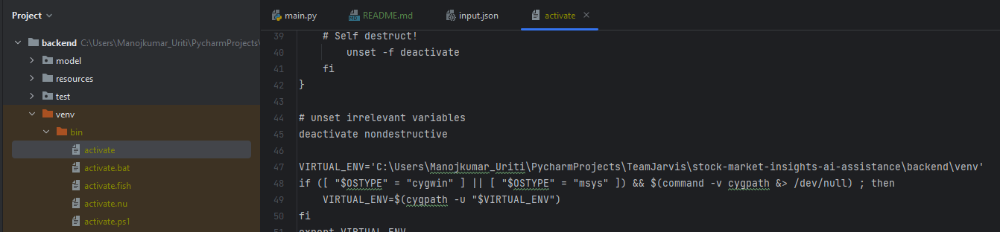

# Intial setup
```commandline
pip install -r requirements.txt 
```
To download all packages 

# change your working venv location 



```commandline
VIRTUAL_ENV='C:\Users\<your_name>\stock-market-insights-ai-assistance\backend\venv'
```
